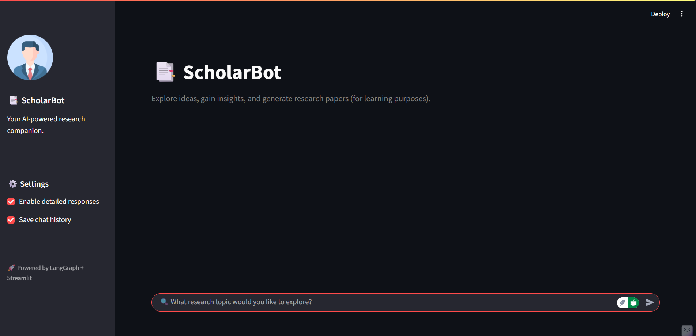
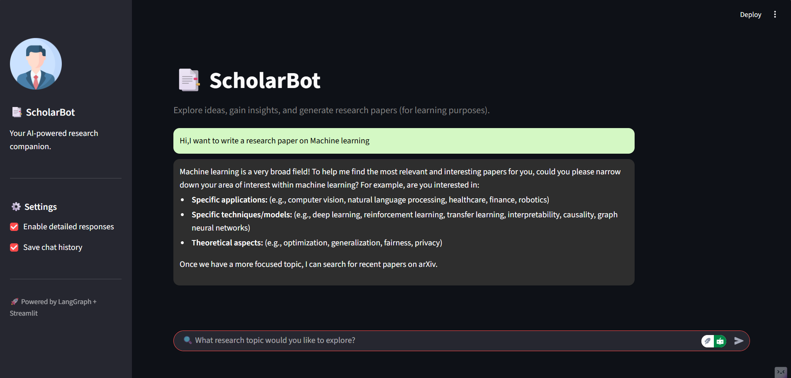

# 📚 ScholarBot – Your AI-powered Research Companion  

ScholarBot helps you **explore ideas, gain insights, and generate research papers** (for learning and educational purposes).  
It combines cutting-edge AI with research tools to make academic exploration faster and smarter.  

---

## 🚀 Features  

- 🔎 Ask research questions in natural language.  
- 📑 Browse & scrape academic papers from **arXiv**.  
- 🤖 AI-powered insights powered by **OpenAI + LangGraph**.  
- 📝 Generate structured **research papers (PDF format)** for learning.  
- 🎨 Clean interface built with **Streamlit**.  

---

## 🛠️ Tech Stack  

- **Frontend**: Streamlit  
- **AI Frameworks**: LangGraph, LangChain, Gemini  
- **Research Tools**: arXiv API, PyPDF2  
- **Backend**: Python  

---

## 📦 Installation  

Clone this repository:  
```bash
git clone https://github.com/TechyKunj/ResearcherAgent-ScholarBot.git
cd ResearcherAgent-ScholarBot
````

Create & activate virtual environment:

```bash
python -m venv venv
source venv/bin/activate   # On Windows: venv\Scripts\activate
```

Install dependencies:

```bash
pip install -r requirements.txt
```

Set up your `.env` file:

```ini
GEMINI_API_KEY=""
```

Run ScholarBot:

```bash
streamlit run frontend.py
```

---

## 🎯 Usage

1. Open the Streamlit interface.
2. Enter your research topic (e.g., `"Machine Learning in Healthcare"`).
3. ScholarBot will:

   * Guide you to refine your research query.
   * Search papers from arXiv.
   * Generate summaries, insights, and even formatted research papers.

💡 **Example**:

```text
Hi, I want to write a research paper on Machine Learning
```

➡️ ScholarBot suggests subfields, retrieves relevant papers, and creates a draft.

---

## 📸 Screenshots


* 🔍 Asking a research question
* 📑 AI-generated research insights

---

## 🤝 Contributing

Contributions are welcome!

1. Fork the repo
2. Create a feature branch
3. Submit a Pull Request 🚀

---
